#Resurrector demos

## Caveats

- "INDI driver" devices are actually test application gausswait:
  - The gausswait.cpp application resides in ```/apps/resurrector/test/```
  - The gausswait executable binaries reside in ```/opt/MagAOX/bin/``` as hard-links gausswait and gauss
  - Does not write logs to flatbuffer files under ```/opt/MagAOX/logs/```,
    - **_But_** do have both their STDOUT and their STDIN redirected to ```/opt/MagAOX/sys/devicename/outputs```
  - Has a Hexbeat timeout of 3s
    - I.e. sends a Hexbeat timestamp that is 3s in the future
  - Will wait the absolute value of a random time (mean=0.0s; sigma=1.0s) between sending the next Hexbeat to resurrector_indi
    - So roughly 1 in 300 times the resurrector will think a Hexbeater's Hexbeat has expired and will restart it
- The ```logdump``` command for this demo, used by the ```peek``` verb of ```resuctrl```, has been hijacked by a bash script in ~/bin/
  - which script is a wrapper for ```tail -n 10 /opt/MagAOX/sys/$3/outputs```
    - see comment above regarding STDOUT and STDERR
    - $3 is the third argument to logdump; $1 and $2 are -n and 1, and are ignored

## Startup

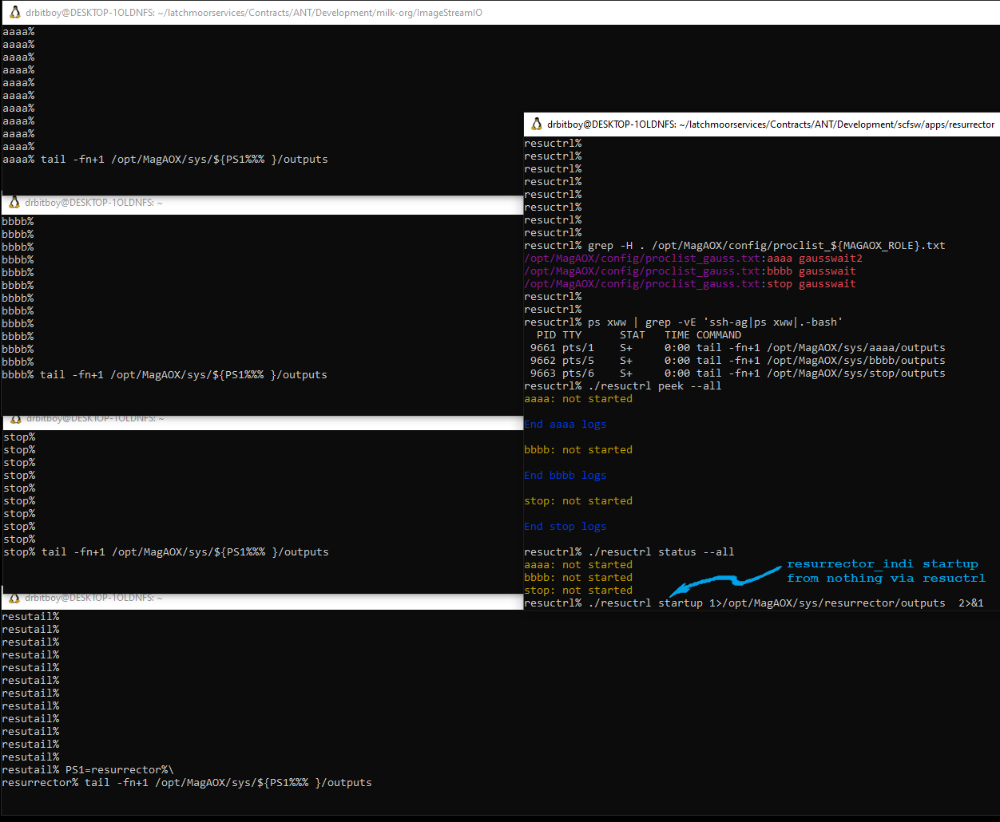

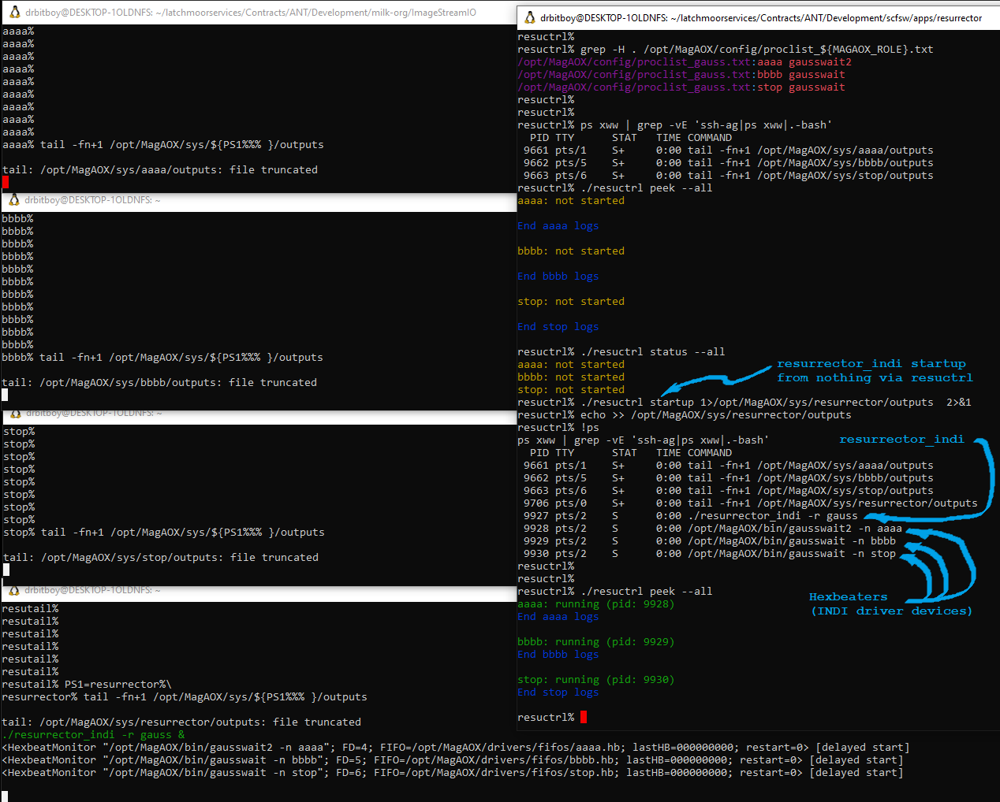

## Uncontrolled Hexbeater crash

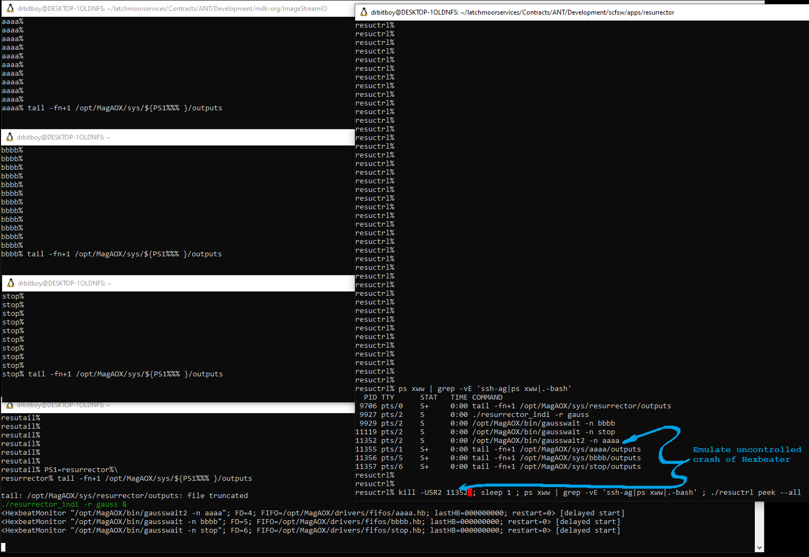
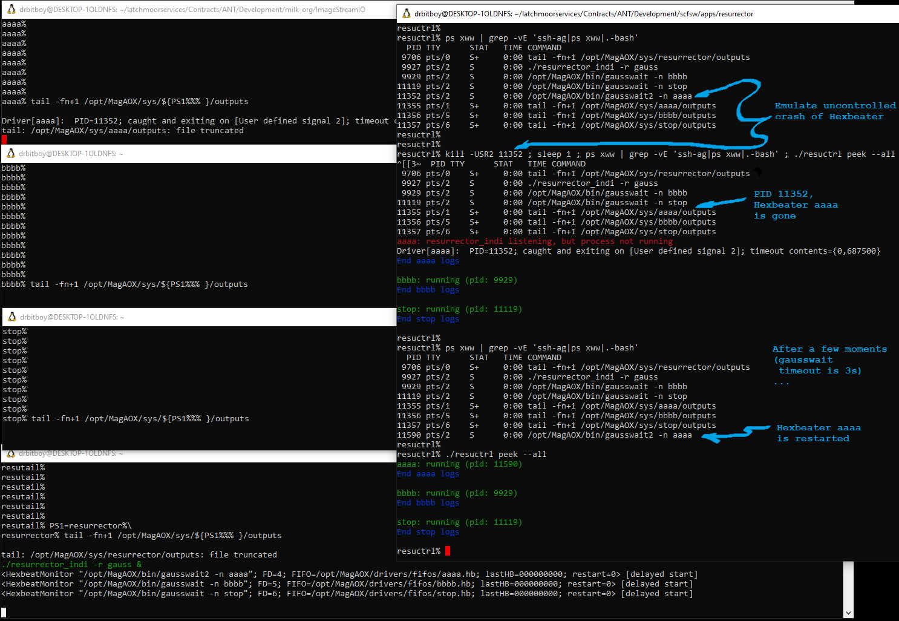

## Stop and disable Hexbeater

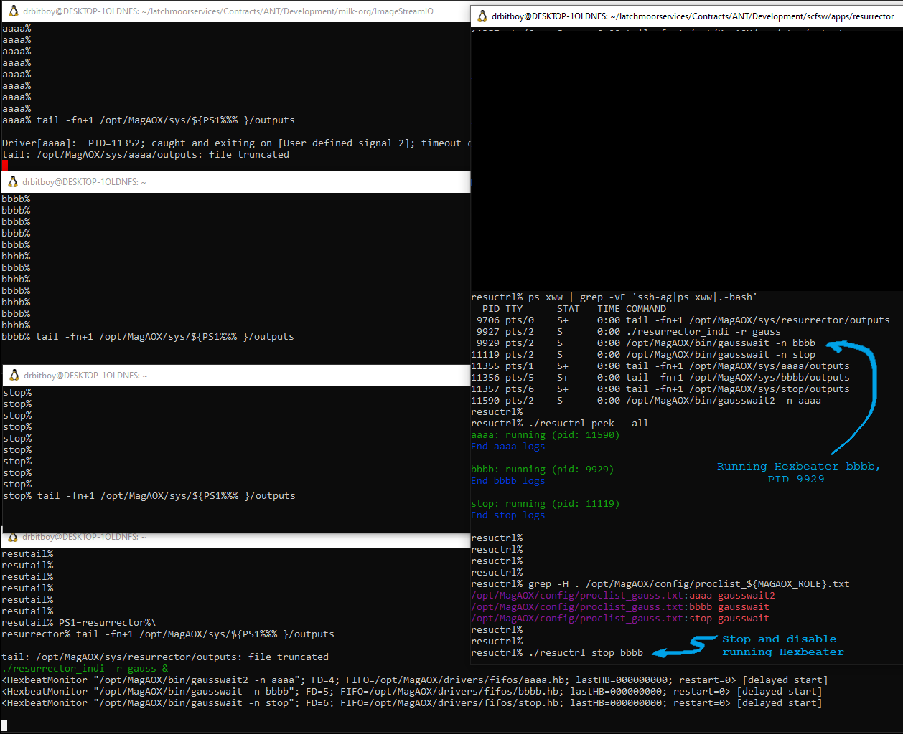
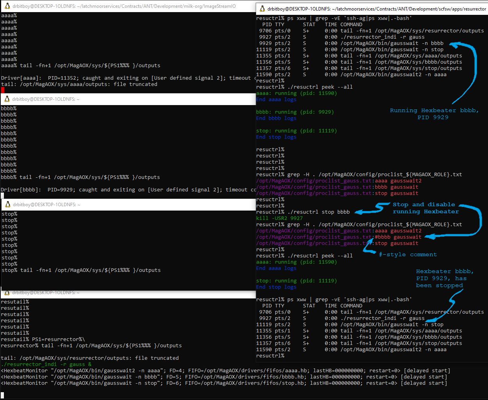

## Stop and disable all Hexbeaters

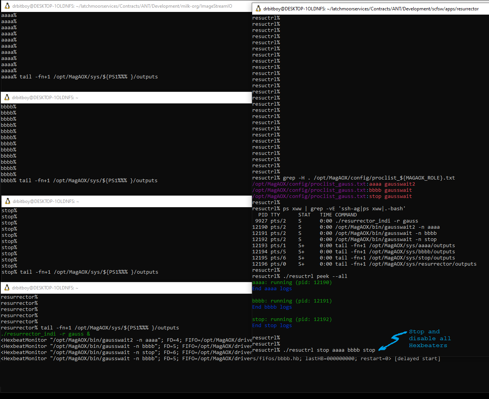
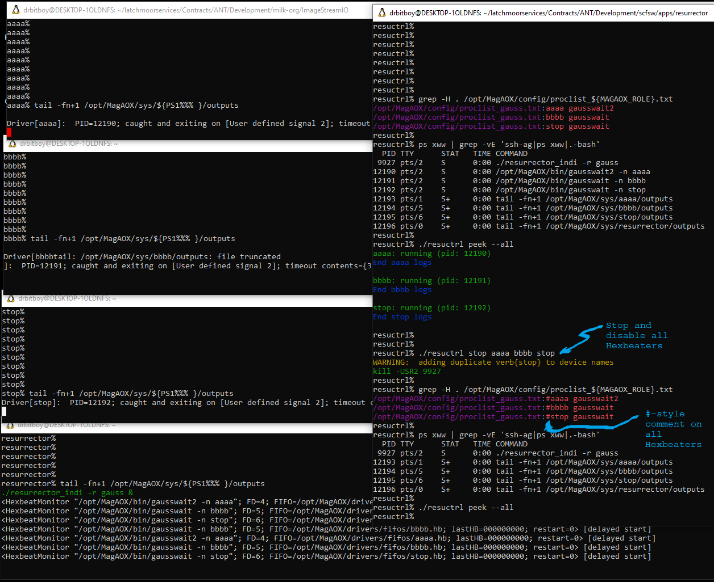
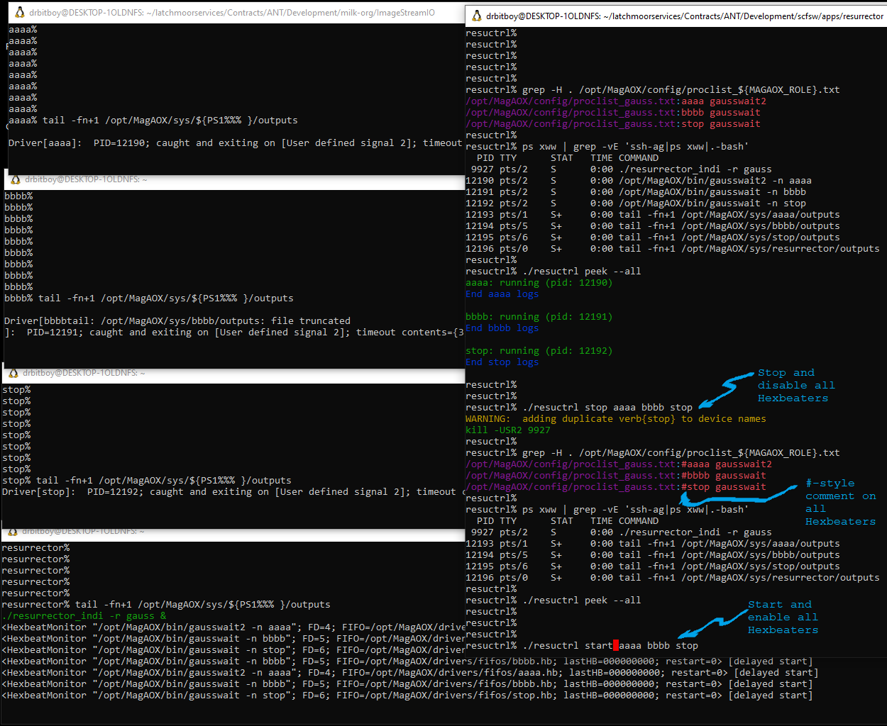
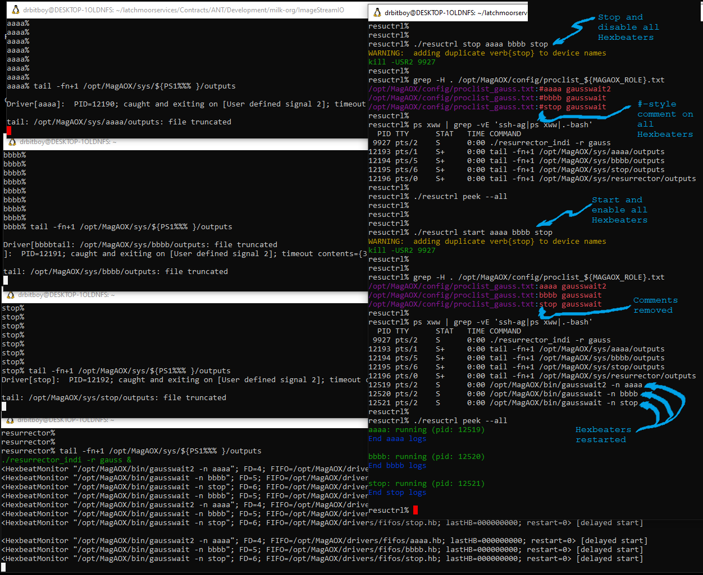

## Uncontrolled resurrector_indi crash

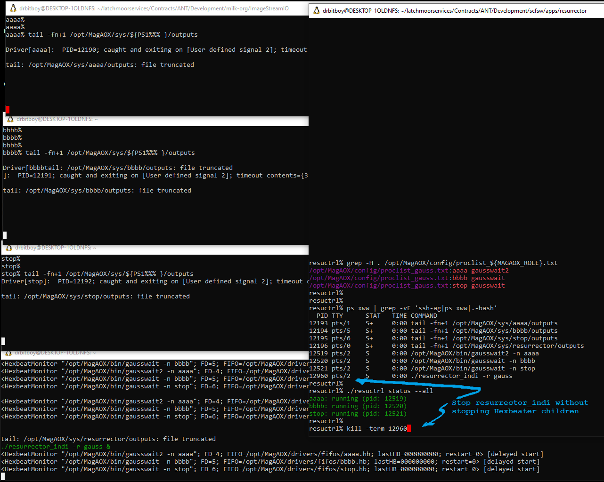
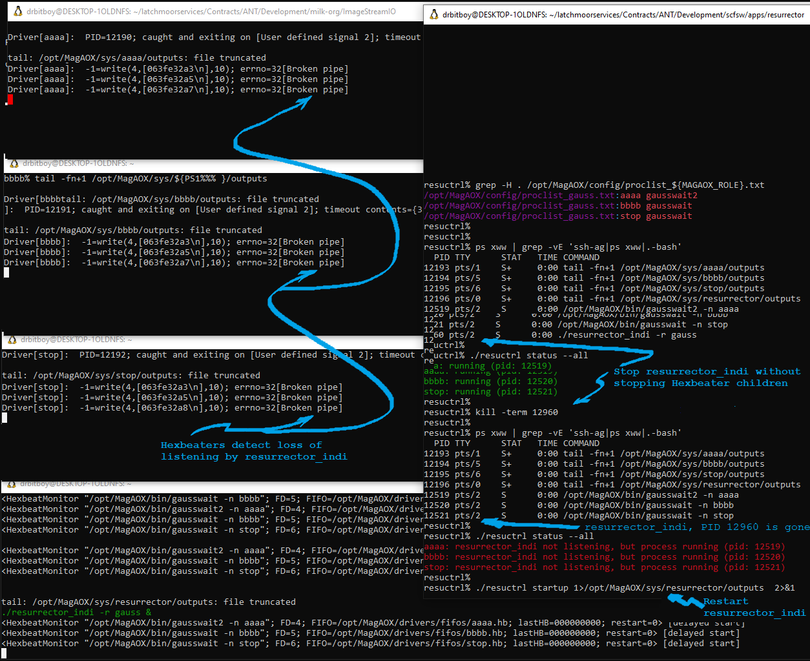
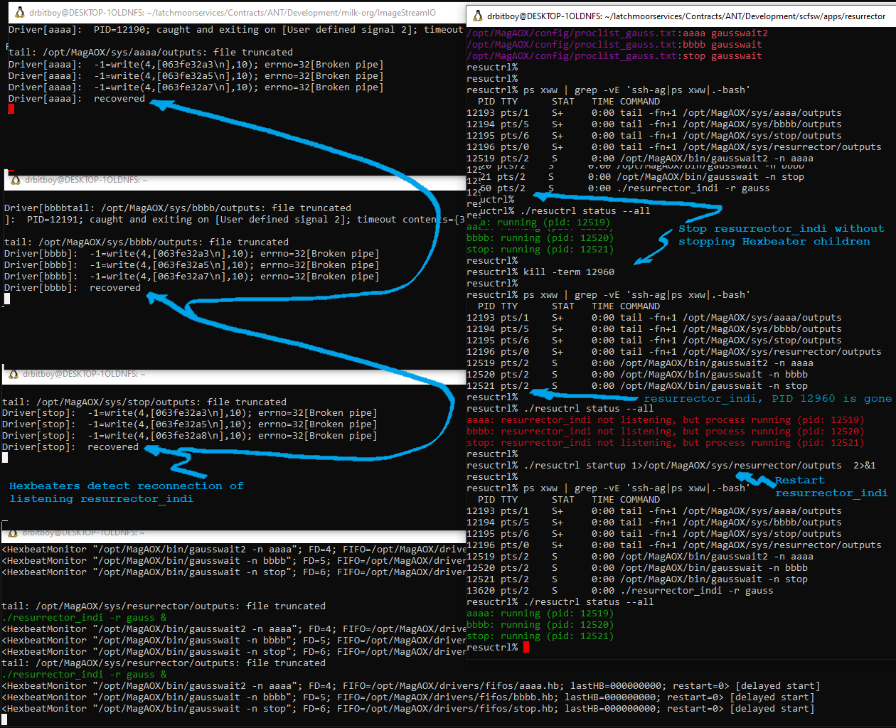
