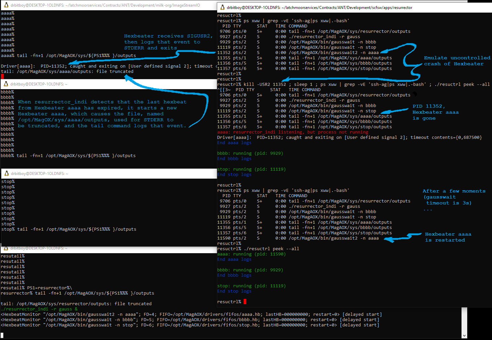

#Resurrector demos

## Caveats and Notes

- The MAGAOX_ROLE environment variable for this demo is ```gauss```
  - The contents of  ```/opt/MagAOX/config/proclist_${MAGAOX_ROLE).txt``` are:
```
aaaa gausswait2
bbbb gausswait
stop gausswait
```
- "INDI driver" devices are actually test application gausswait:
  - The gausswait.cpp application resides in ```/apps/resurrector/test/```
  - The gausswait executable binaries reside in ```/opt/MagAOX/bin/``` as hard-links gausswait and gauss
  - The gausswait app
    - Does not write logs to flatbuffer files under ```/opt/MagAOX/logs/```,
      - **_But_** do have both their STDOUT and their STDIN redirected to ```/opt/MagAOX/sys/devicename/outputs```
    - Has a Hexbeat timeout of 3s
      - I.e. sends a Hexbeat timestamp that is 3s in the future
    - Will wait the absolute value of a random time (mean=0.0s; sigma=1.0s) between sending the next Hexbeat to resurrector_indi
      - So roughly 1 in 300 times the resurrector will think a Hexbeater's Hexbeat has expired and will restart it
- The ```logdump``` command for this demo, used by the ```peek``` verb of ```resuctrl```, has been hijacked by a bash script in ~/bin/
  - which script is a wrapper for ```tail -n 10 /opt/MagAOX/sys/$3/outputs```
    - See comment above regarding STDOUT and STDERR
  - The logdump command in the ```peek``` verb is executed as ```logdump -n 1 device-name```
    - The third argument \$3 to the logdump command is the "INDI driver" device name, from the first column of ```/opt/MagAOX/config/proclist_${MAGAOX_ROLE).txt```
    - Arguments \$1 and \$2 are -n and 1, and are ignored
- Refer to the turquoise annotations in the images below for more detail
- Usage/help text from resuctrl (current ca. 2023-02-28):
```
usage: [MAGAOX_ROLE=ROLE] resuctrl [-h|--help] [-r ROLE|--role ROLE] \
             startup|shutdown|restart|start|stop|defib|peek|status \
             [PROCNAME[ PROCNAME[ ...]]]

MagAO-X Process Control

2023-02-28 - BTCarcich - Updated to use resurrector_indi framework

Usage:

    resuctrl startup [--all]
        - startup resurrector_indi and all processes in proclist

    resuctrl shutdown [--all]
        - shutdown all processes including resurrector_indi

    resuctrl restart
        - have resurrector_indi shutdown then startup each running process

    resuctrl start PROCNAME[ PROCNAME[ ...]]
        - enable and start PROCNAME processes in proclist

    resuctrl stop --all|PROCNAME[ PROCNAME[ ...]]
        - disable and stop PROCNAME processes in proclist

    resuctrl defib --all|PROCNAME[ [PROCNAME ...]]
        - declare to resurrector that PROCNAME processes have expired,
          so they will be restarted by resurrector_indi

    resuctrl peek --all|PROCNAME [PROCNAME ...]
        - show status and last few log lines (via logdump) for each process

    resuctrl status --all|PROCNAME [PROCNAME ...]
        - show status for each process

positional arguments:
  {startup,shutdown,restart,start,stop,defib,peek,status}
                        verb for action to take

proclist is contents of file::
  /opt/MagAOX/config/proclist_gauss.txt

optional arguments:
  -h, --help            show this help message and exit
  -r ROLE, --role ROLE  Specify role to read proclist for (default:gauss)
```

## Startup

### Step 1

### Step 2


## Uncontrolled Hexbeater crash

### Step 1

### Step 2


## Stop and disable Hexbeater

### Step 1

### Step 2


## Stop and disable all Hexbeaters

### Step 1

### Step 2

### Step 3

### Step 4


## Uncontrolled resurrector_indi crash

### Step 1

### Step 2

### Step 3


## Defibrillate Hexbeater

### Step 1

### Step 2

